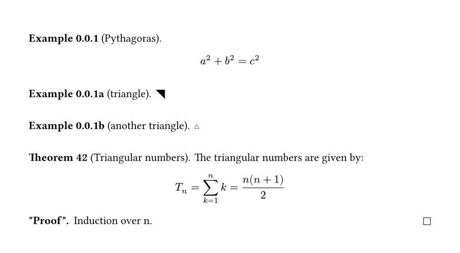

# anki-typst
Create anki cards from typst.

This exports your typst notes to images and creates anki notes containing them.

## Writing cards

For more information see the [manual](./typst/doc/doc.pdf)

### via theorem environment
anki-typst defines a theorem interface similar to [typst-theorems](https://github.com/sahasatvik/typst-theorems/):
```typst
#import @local/anki:0.2.0
#import anki.theorems: item
// Don't forget this! v
#show: anki.setup.with(enable_theorems: true)

// create item kinds
#let example = item("Example", initial_tags: ("example",))
#let theorem = item("Theorem", proof_name: "\"Proof\"")

// create item
#example("Pythagoras")[
 $ a^2 + b^2 = c^2 $
]

// use secondary numbering
#example("triangle", secondary: auto)[
  #sym.triangle.tr.filled
]
#example("another triangle", secondary: auto)[
  #sym.triangle.t.stroked
]

// and a theorem, with a custom number
#theorem("Triangular numbers", number: "42")[
  The triangular numbers are given by:
  $ T_n = sum_(k=1)^n k = (n(n+1))/2 $
][
  Induction over n.
]
```


### via raw function
But you can also use the raw export function:
```typst
#import @local/anki:0.2.0: anki_export

#anki_export(
  id: "id 29579",
  tags: ("Perfect", ),
  deck: "beauty",
  model: "simple",
  question: "Are you beautiful?",
  answer: "Yes!",
)
```


## Generating anki cards
* Make sure to install the command line interface
* run `anki-typst create-all-decks -p main.typ`
* then `anki-typst create-default-model`
* and finally `anki-typst create -p main.typ`

## Installing
* install [typst](https://github.com/typst/typst?tab=readme-ov-file#installation) ;)
* install [rust](https://www.rust-lang.org/tools/install)
* go to the `cli` folder and execute `install.sh`. This will install the command line interface to create anki cards from typst
* go to the `typst` folder and execute `python install.py`. This will install the `anki` package to the local package folder
